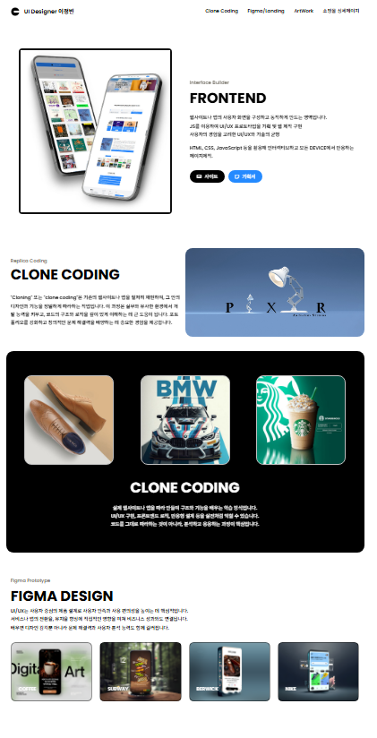
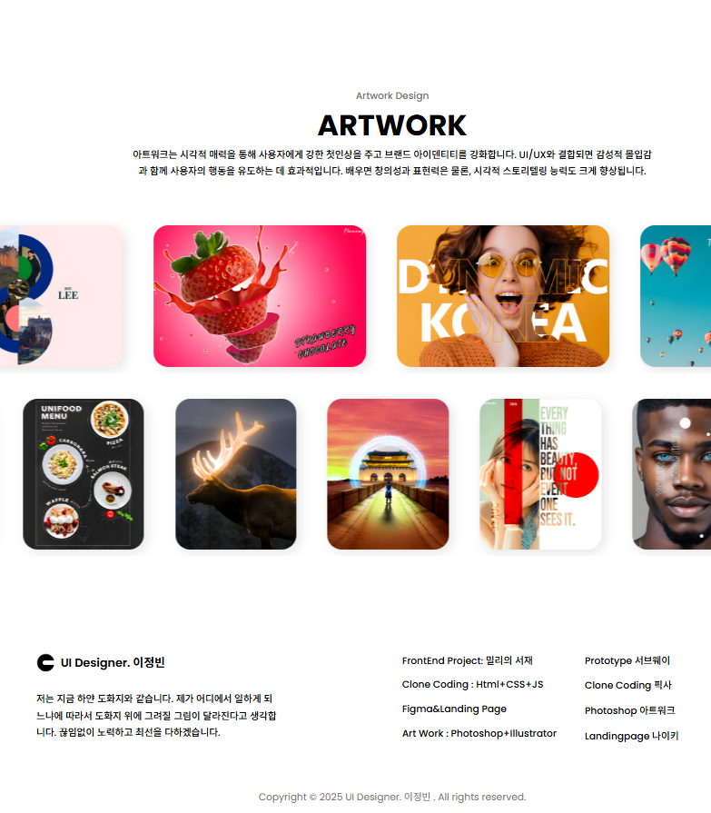
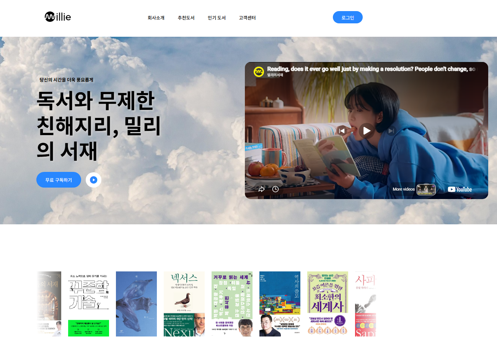
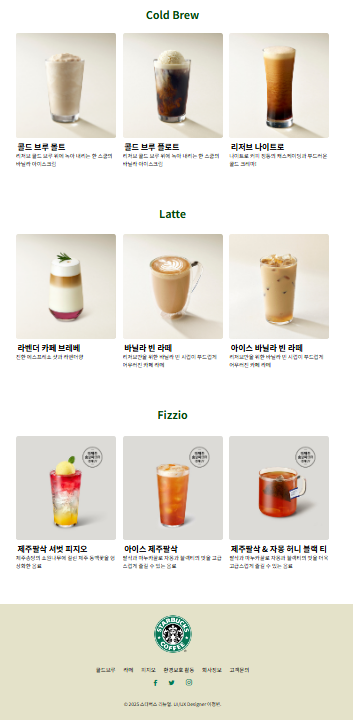

# Frontend Projects

> HTML, CSS, JavaScript로 만든 프론트엔드 연습 프로젝트 모음입니다.


---

## 프로젝트 구조

```
frontend-projects/
├── clone/          # 유명 브랜드 사이트 클론 코딩
├── css/            # CSS 실습 프로젝트
├── js/             # JavaScript 실습 프로젝트
├── landing/        # 랜딩 페이지
├── rolling/        # 롤링 배너
└── rolling-milli/  # 롤링 배너 (밀리 버전)
```

---

## Clone Projects

유명 브랜드 사이트를 직접 구현한 클론 코딩 프로젝트입니다.

### 밀리의 서재


### Starbucks


### Pixar


### BMW
포트폴리오 페이지에서 확인 가능합니다.

---

## 포트폴리오 페이지


---

## 학습 목표

- 시맨틱 HTML(= 의미 있는 태그를 사용하는 HTML 작성 방식) 구조 설계
- CSS 레이아웃 (Flexbox, Grid) 숙련
- 바닐라 JS(= 순수 JavaScript, 라이브러리 없이 작성)로 DOM 조작
- 실제 서비스 수준의 UI 재현 능력 향상

---

## 기술 스택

- **HTML5** - 시맨틱 마크업
- **CSS3** - Flexbox, Grid, Animation
- **Vanilla JavaScript** - DOM 조작, 이벤트 처리

---

## 실행 방법

별도 설치 없이 브라우저에서 바로 실행 가능합니다.

```
원하는 프로젝트 폴더의 index.html을 VSCode Live Server로 열기
```

---

## 관련 프로젝트

- [IBM 1st Project (팀 프로젝트)](https://github.com/lee123456a-24/IBM-1st-Project) - 팀 협업 웹 개발 프로젝트
